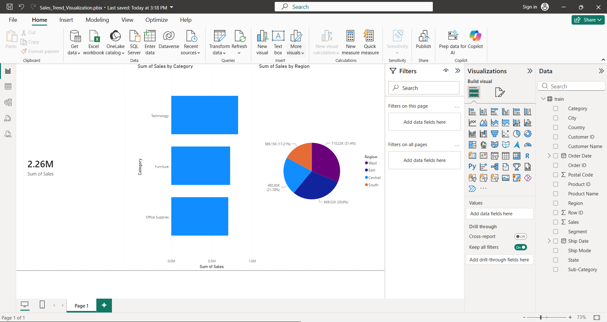

# 📊 Sales Trend Visualization Dashboard

## 📌 Project Overview
**Company:** CODTECH IT SOLUTIONS  
**Name:** Subham Kumar Swain  
**Intern ID:** ITSC7752
**Domain:** Data Analytics  
**Duration:** 6 Weeks  

---

## 🎯 Objective
The primary objective of this project is to analyze superstore sales data using **Power BI** to identify overall sales metrics, category-level revenue contributions, and geographical distribution of sales across different regions.

---

## 🔑 Key Features & Insights
1. **Total Sales KPI:** Visualizes the cumulative revenue generated ($2.26M).
2. **Category Performance:** Highlighting top-performing product categories (Technology, Furniture, Office Supplies).
3. **Regional Breakdown:** Interactive Pie chart illustrating sales distribution across West, East, Central, and South regions.

---

## 🛠️ Tools & Technologies Used
* **Power BI Desktop:** For Data Cleaning, Visualization, and Interactive Dashboard Creation.
* **Dataset:** Superstore Sales Dataset (CSV format).

---

## 📷 Dashboard Preview

